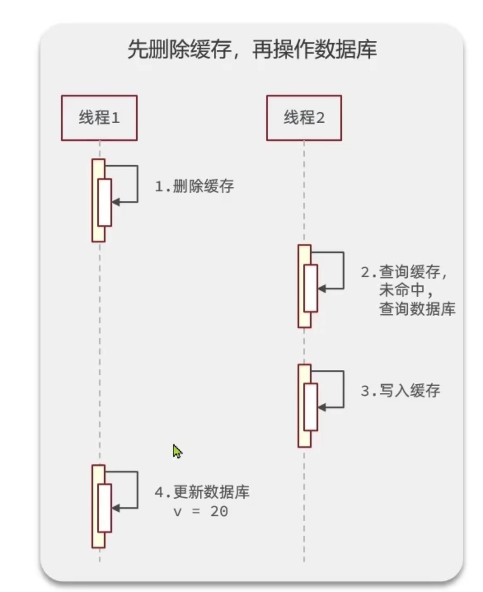
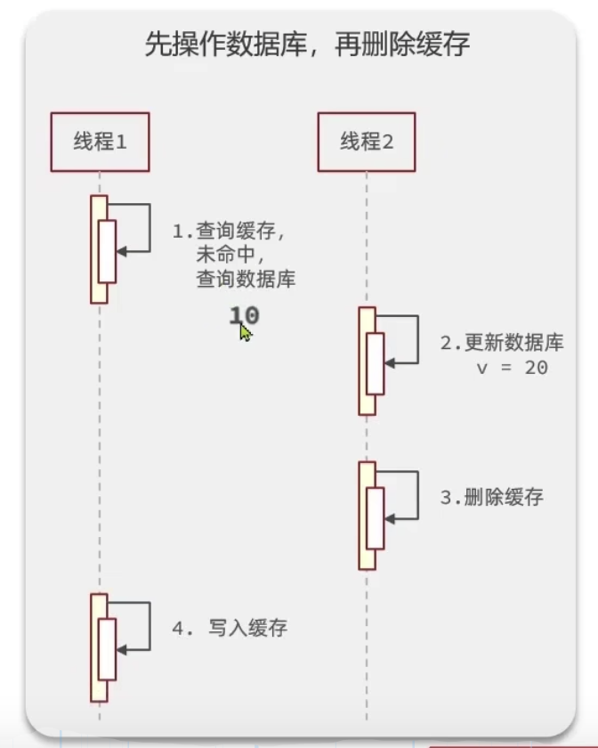

# Redis_tutorial

## 缓存更新策略

操作缓存还是数据库时有三个问题需要考虑：

1. 删除缓存还是更新缓存？
   1. 更新缓存：每次更新数据库都要更新缓存，但是期间可能没有那么多查询这个数据的请求，所以无效的写操作会比较多；
   2. 删除缓存：更新数据库时让缓存失效，查询时再更新缓存；
2. 如何保证缓存与数据库的操作的同时成功或失败？
   1. 单体系统，将缓存与数据库操作放在一个事务中；
   2. 分布式系统，利用分布式事务；
3. 先操作缓存还是先操作数据库？
   1. 先删缓存，再操作数据库；
      1. 
   2. 先操作数据库，再删除缓存；
      1. 

更新数据库的这个操作时间会比较长，所以2这种情况发生的概率比较小。